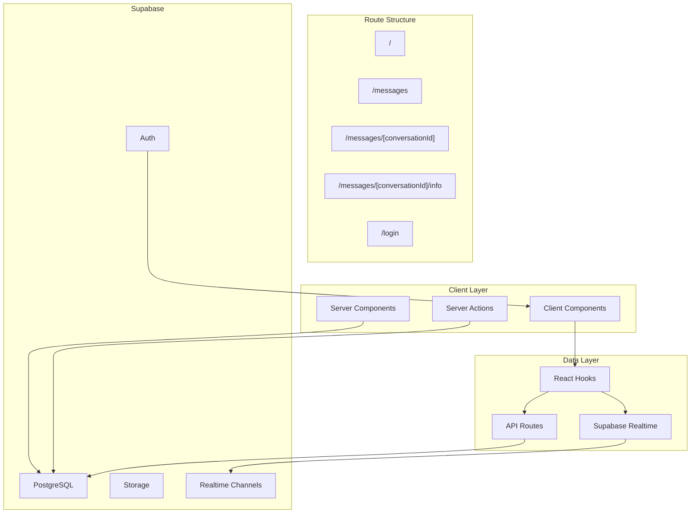
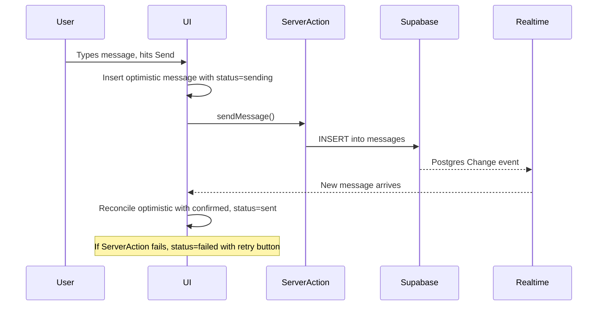

# Matrx DM -- Full Build Plan

## Current State

The scaffold is solid. The following are already in place:

- **Next.js 16.1** App Router with React 19.2, TypeScript, Tailwind 4.1, React Compiler enabled
- **Supabase** fully wired: client/server helpers, auth flow (login/signup, callback, app layout guard), `proxy.ts` for session management
- **Database**: 6 tables (profiles, conversations, conversation_participants, messages, message_reactions, attachments) with RLS, 3 RPC functions, Realtime enabled, storage policies created
- **Design tokens** in `[app/globals.css](app/globals.css)`: semantic colors (dark-first), type scale, animation keyframes, glass/scrollbar-hide/safe-area utilities
- **Dependencies**: framer-motion, lucide-react, @tanstack/react-virtual, clsx + tailwind-merge
- **Generated types** in `[lib/types/database.ts](lib/types/database.ts)`
- **Utility**: `cn()` in `[lib/cn.ts](lib/cn.ts)`

Everything below is net-new work.

---

## Architecture Overview




---

## Phase 1: Application Types and Data Utilities

Define application-level types that sit on top of the generated Supabase types, plus helper functions for data formatting.

**Files to create:**

- `lib/types/index.ts` -- App-level types: `Conversation`, `Message`, `Profile`, `ConversationWithDetails`, `MessageWithSender`, `TypingEvent`, `PresenceState`, `SendMessagePayload`, `MessageStatus` (enum: sending/sent/delivered/read/failed)
- `lib/utils/format.ts` -- `formatTimestamp()` (relative time: "just now", "5m", "2h", "Yesterday", date), `formatMessagePreview()` (truncate + strip media), `getInitials()` from display name, `getAvatarColor()` deterministic color from user ID

---

## Phase 2: Foundation Components

Small, stateless, zero-side-effect primitives. Each in its own file under `components/ui/`.


| Component  | File                           | Key details                                                                                                   |
| ---------- | ------------------------------ | ------------------------------------------------------------------------------------------------------------- |
| Avatar     | `components/ui/Avatar.tsx`     | Sizes: xs(24)/sm(32)/md(40)/lg(56). Image with shimmer fallback to gradient + initials. Online dot indicator. |
| IconButton | `components/ui/IconButton.tsx` | Variants: ghost/subtle/solid. 44px min touch target. Wraps Lucide icons. Optional tooltip.                    |
| Badge      | `components/ui/Badge.tsx`      | Red dot for 99+, number for 1-99, hidden for 0. Spring scale entrance animation.                              |
| Spinner    | `components/ui/Spinner.tsx`    | Custom SVG spinner matching design language. Sizes: sm/md/lg.                                                 |
| Divider    | `components/ui/Divider.tsx`    | Horizontal/vertical, uses border-subtle.                                                                      |


Also create `components/ui/index.ts` barrel export.

---

## Phase 3: Server Actions and API Routes

Server-side data operations that both the conversation list (Server Component) and client interactions need.

**Server Actions** (`lib/actions/`):

- `lib/actions/messages.ts` -- `sendMessage(conversationId, content, type?, replyToId?)`, `editMessage(messageId, content)`, `deleteMessage(messageId)`
- `lib/actions/conversations.ts` -- `createDirectConversation(otherUserId)`, `createGroupConversation(name, userIds)`, `markConversationRead(conversationId, messageId)`, `togglePin(conversationId)`, `toggleMute(conversationId)`

**API Routes** (for mobile/cross-client consumption):

- `app/api/messages/route.ts` -- POST to send message
- `app/api/conversations/route.ts` -- GET list, POST create
- `app/api/conversations/[conversationId]/read/route.ts` -- POST mark read

---

## Phase 4: Realtime Hooks

Client-side hooks that power live messaging. All go in `lib/hooks/`.

- `useRealtimeMessages(conversationId)` -- Subscribes to Postgres Changes on `messages` table filtered by conversation_id. Returns live message array, handles optimistic inserts, reconciliation on confirmation, and error/retry state.
- `useTypingIndicator(conversationId)` -- Broadcast channel for typing events. Exposes `startTyping()`, `stopTyping()`, and `typingUsers: Profile[]`.
- `usePresence(userIds)` -- Tracks online/offline status via Supabase Presence. Returns map of userId to online/lastSeen.
- `useConversationList(initialData)` -- Takes server-fetched data, subscribes to Realtime for new messages/conversation updates, keeps sidebar in sync.

---

## Phase 5: Messaging Components

The core UI components. Each in `components/messaging/`.

### ConversationListItem

`components/messaging/ConversationListItem.tsx`

- Avatar, name, preview text, timestamp, unread badge, muted/pinned indicators
- Swipe actions on mobile (framer-motion): swipe-left for delete/mute, swipe-right for pin
- Right-click context menu trigger on desktop
- Active state highlight when selected

### MessageBubble

`components/messaging/MessageBubble.tsx`

- Sent (right, accent bg) vs received (left, tertiary bg) styling
- Consecutive message grouping: omit avatar/name for sequential same-sender messages
- Reactions display row beneath bubble
- Reply-to quote block above content
- Delivery status indicator (sending/sent/delivered/read) for sent messages
- Long-press/right-click triggers context menu
- `animate-message-in` entrance animation

### MessageInput

`components/messaging/MessageInput.tsx`

- Auto-growing textarea (capped at ~6 lines)
- Send button (accent, appears when content exists)
- Attachment trigger (+), emoji trigger (smiley face)
- Enter to send, Shift+Enter for newline
- Reply-to bar above input when replying
- Typing indicator integration (debounced broadcast on keystroke)

### MessageThread

`components/messaging/MessageThread.tsx`

- Virtualized scroll via @tanstack/react-virtual for 10k+ messages
- Scroll-to-bottom behavior with "new messages" pill indicator
- Date separator headers between day groups
- Loading skeleton for initial fetch
- Composes MessageBubble for each message

### ConversationHeader

`components/messaging/ConversationHeader.tsx`

- Conversation name/avatar, online status, member count (for groups)
- Action buttons: audio call, video call, info panel
- Glass backdrop-blur on scroll overlay
- Back button on mobile (returns to sidebar/conversation list)

---

## Phase 6: Overlay Components

Interactive overlays in `components/overlays/`.

### ContextMenu

`components/overlays/ContextMenu.tsx`

- Triggered by right-click (desktop) or long-press (mobile)
- Glass effect background with spring-scale animation
- Sections with dividers, icons, destructive items (red)
- Keyboard navigation (arrow keys, Enter, Escape)
- Portal-rendered to avoid z-index/overflow issues
- Two presets: `MessageContextMenu` (reply, copy, edit, delete, react) and `ConversationContextMenu` (pin, mute, mark unread, delete)

### EmojiPicker

`components/overlays/EmojiPicker.tsx`

- Lazy-loaded (dynamic import, not in main bundle)
- Searchable grid with category tabs (matching reference screenshot bottom bar)
- Recent emojis stored in localStorage
- Popover anchored to trigger button
- Keyboard navigation within grid

### Sheet

`components/overlays/Sheet.tsx`

- Slide-up panel for mobile (new message composer, conversation details)
- Spring-physics drag-to-dismiss via framer-motion
- Backdrop dim overlay
- Configurable snap points

### Toast

`components/overlays/Toast.tsx`

- Context provider + `useToast()` hook
- Auto-dismiss (3s default), stackable
- Variants: success, error, info
- Appears from top, animates out

---

## Phase 7: Navigation and Layout

### Sidebar

`components/navigation/Sidebar.tsx`

- Search bar at top
- Filter tabs: All / Unread / Groups
- Pinned conversations section (if any pinned)
- Scrollable conversation list (composes ConversationListItem)
- New conversation FAB button
- Responsive behavior:
  - Desktop (1024px+): persistent 320px panel
  - Tablet (768-1023px): overlay sheet with backdrop
  - Mobile (<768px): full-screen view, tapping conversation navigates to thread

### SearchBar

`components/navigation/SearchBar.tsx`

- Expandable on mobile (icon to full-width)
- Filters conversations by name and message content
- Debounced server search for message content
- Client-side filter for conversation names

---

## Phase 8: Route Structure and Layouts

Build out the complete App Router structure with loading skeletons.

```
app/
  (app)/
    layout.tsx          -- Auth guard (exists), add Sidebar + responsive shell
    messages/
      layout.tsx        -- Sidebar + content area split layout
      page.tsx          -- Empty state ("Select a conversation")
      [conversationId]/
        page.tsx        -- MessageThread + MessageInput + ConversationHeader
        loading.tsx     -- Shimmer skeleton matching thread layout
        info/
          page.tsx      -- Conversation details (members, media, settings)
  login/
    page.tsx            -- Exists
  api/
    messages/
      route.ts
    conversations/
      route.ts
      [conversationId]/
        read/
          route.ts
```

### Key layout logic in `app/(app)/messages/layout.tsx`:

- Desktop: `<Sidebar />` + `<main>{children}</main>` side by side
- Mobile: Sidebar is the default view; selecting a conversation navigates to `[conversationId]` which renders full-screen thread with a back button
- Use URL state (the conversationId param) as the single source of truth for active conversation

### Loading states:

- `app/(app)/messages/loading.tsx` -- Sidebar skeleton (shimmer rows)
- `app/(app)/messages/[conversationId]/loading.tsx` -- Thread skeleton (shimmer header + bubble shapes)

---

## Phase 9: Realtime Wiring and Polish

Connect all the realtime hooks to the UI:

1. **Message delivery**: `useRealtimeMessages` in the thread page. New messages from others appear instantly. Own messages show optimistic state then reconcile.
2. **Typing indicators**: Display "User is typing..." below the last message or in the conversation header. Debounce broadcast events (300ms).
3. **Presence**: Online dots on avatars in sidebar and conversation header. Update via Supabase Presence channel.
4. **Conversation list sync**: New messages update preview text, timestamp, and unread count in the sidebar in real-time without page refresh.
5. **Connection resilience**: Show "Reconnecting..." banner after 3s disconnect. On reconnect, fetch missed messages since last received timestamp.

### Optimistic Update Flow




---

## Phase 10: Responsive and Mobile Polish

- Test and tune all breakpoint transitions (sidebar collapse, overlay behavior)
- Swipe gestures on ConversationListItem (pin, mute, delete)
- Swipe-to-reply on MessageBubble
- Pull-to-refresh on conversation list
- Safe area handling (safe-bottom, safe-top utilities)
- Touch target verification (44px minimum everywhere)
- `prefers-reduced-motion` -- all animations respect motion-reduce via Tailwind variants

---

## Phase 11: Deployment to Vercel

- Verify `next.config.ts` is production-ready (image domains, React Compiler)
- Set environment variables in Vercel: `NEXT_PUBLIC_SUPABASE_URL`, `NEXT_PUBLIC_SUPABASE_PUBLISHABLE_KEY`
- Configure Supabase CORS to allow the Vercel domain
- Add `vercel.json` if needed for any custom headers/rewrites
- Run production build locally to catch any issues before deploy
- Deploy via `vercel` CLI or Git push

---

## File Structure Summary

```
components/
  ui/
    Avatar.tsx
    Badge.tsx
    Divider.tsx
    IconButton.tsx
    Spinner.tsx
    index.ts
  messaging/
    ConversationHeader.tsx
    ConversationListItem.tsx
    MessageBubble.tsx
    MessageInput.tsx
    MessageThread.tsx
  overlays/
    ContextMenu.tsx
    EmojiPicker.tsx
    Sheet.tsx
    Toast.tsx
  navigation/
    Sidebar.tsx
    SearchBar.tsx
lib/
  types/
    database.ts          (exists)
    index.ts             (new)
  actions/
    messages.ts
    conversations.ts
  hooks/
    useRealtimeMessages.ts
    useTypingIndicator.ts
    usePresence.ts
    useConversationList.ts
  utils/
    format.ts
  cn.ts                  (exists)
  supabase/              (exists)
app/
  (app)/
    messages/
      layout.tsx         (rewrite)
      page.tsx           (rewrite)
      [conversationId]/
        page.tsx
        loading.tsx
        info/
          page.tsx
  api/
    messages/
      route.ts
    conversations/
      route.ts
      [conversationId]/
        read/
          route.ts
```

---

## Execution Order

Phases 1-2 are independent foundations. Phase 3 provides the data layer. Phases 4-7 build the UI from inside out. Phase 8 wires everything into routes. Phases 9-10 add real-time and polish. Phase 11 ships it.

Each phase produces testable, working code. By the end of Phase 8, the app is fully functional with static data. Phase 9 makes it live. Phase 10 makes it feel native. Phase 11 makes it public.