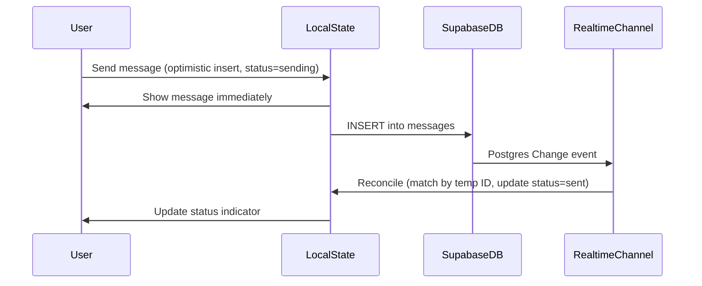
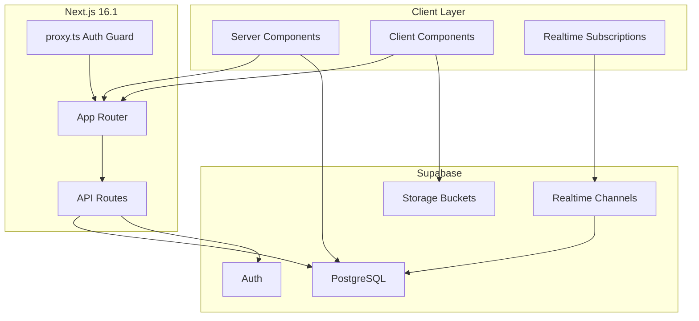

# Matrx DM -- Universal Messaging Platform Build Plan

## Phase 1: Project Scaffold

Initialize a Next.js 16.1 app with the full toolchain.

- `pnpm create next-app@latest . --typescript --tailwind --eslint --app --turbopack --import-alias "@/*"`
- Add core dependencies: `supabase-js@2.93`, `lucide-react`, `clsx`, `tailwind-merge`, `framer-motion` (for gesture physics on swipe/drag)
- TypeScript 5.9 strict mode in `tsconfig.json` (`strict: true`, `noUncheckedIndexedAccess: true`)
- `next.config.ts` with `reactCompiler: true`, image loader config for Supabase Storage
- `.gitignore`, `.env.local.example` with Supabase keys placeholders
- ESLint config enforcing no inline styles, no CSS modules

**Key files created:**

- `package.json`, `tsconfig.json`, `next.config.ts`
- `app/layout.tsx` (root layout with system font stack, theme provider)
- `app/globals.css` (Tailwind 4.1 CSS-first config with `@theme` directives)
- `lib/cn.ts` (clsx + tailwind-merge utility)
- `lib/supabase/client.ts`, `lib/supabase/server.ts` (browser and server Supabase clients)

**Note on Tailwind 4.1:** The VISION.md references `tailwind.config.ts`, but Tailwind 4.1 uses CSS-first configuration with `@theme` directives. All design tokens (colors, spacing, typography, shadows, animations) will live in `app/globals.css` under `@theme` blocks. The design intent is identical -- single source of truth for all tokens -- only the file location changes.

---

## Phase 2: Supabase Database Schema

Create a new Supabase project and build the complete schema for the messaging platform.

### Tables

```
profiles
  - id (uuid, FK -> auth.users.id, PK)
  - display_name (text, not null)
  - avatar_url (text, nullable)
  - status_text (text, nullable)
  - is_online (boolean, default false)
  - last_seen_at (timestamptz)
  - created_at, updated_at

conversations
  - id (uuid, PK, default gen_random_uuid())
  - type (text, check: 'direct' | 'group')
  - name (text, nullable -- null for direct, required for group)
  - avatar_url (text, nullable)
  - created_by (uuid, FK -> profiles.id)
  - is_pinned (boolean, default false)  -- per-user via participants
  - created_at, updated_at

conversation_participants
  - id (uuid, PK)
  - conversation_id (uuid, FK -> conversations.id)
  - user_id (uuid, FK -> profiles.id)
  - role (text, check: 'owner' | 'admin' | 'member')
  - is_muted (boolean, default false)
  - is_pinned (boolean, default false)
  - last_read_message_id (uuid, FK -> messages.id, nullable)
  - joined_at (timestamptz)
  - UNIQUE(conversation_id, user_id)

messages
  - id (uuid, PK, default gen_random_uuid())
  - conversation_id (uuid, FK -> conversations.id, indexed)
  - sender_id (uuid, FK -> profiles.id)
  - content (text, nullable)
  - type (text, check: 'text' | 'image' | 'video' | 'file' | 'system')
  - reply_to_id (uuid, FK -> messages.id, nullable)
  - is_edited (boolean, default false)
  - is_deleted (boolean, default false)
  - created_at (timestamptz, indexed)
  - updated_at (timestamptz)

message_reactions
  - id (uuid, PK)
  - message_id (uuid, FK -> messages.id)
  - user_id (uuid, FK -> profiles.id)
  - emoji (text, not null)
  - created_at (timestamptz)
  - UNIQUE(message_id, user_id, emoji)

attachments
  - id (uuid, PK)
  - message_id (uuid, FK -> messages.id)
  - file_url (text, not null)
  - file_name (text)
  - file_type (text)
  - file_size (bigint)
  - thumbnail_url (text, nullable)
  - width (integer, nullable)
  - height (integer, nullable)
  - created_at (timestamptz)
```

### RLS Policies

- **profiles:** Users can read any profile. Users can update only their own profile.
- **conversations:** Users can only read conversations they participate in (via `conversation_participants`).
- **conversation_participants:** Users can read participants for conversations they belong to. Only conversation owners/admins can add/remove participants.
- **messages:** Users can read messages in conversations they participate in. Users can insert messages only into conversations they belong to. Users can update/delete only their own messages.
- **message_reactions:** Users can read reactions on messages they can see. Users can insert/delete only their own reactions.
- **attachments:** Follows same visibility as messages.

### Database Functions

- `get_conversations_for_user(user_id)` -- Returns conversations with latest message, unread count, and participant info (avoids N+1 queries)
- `send_message(conversation_id, content, type, reply_to_id)` -- Inserts message and updates conversation's `updated_at`
- `mark_conversation_read(conversation_id, message_id)` -- Updates `last_read_message_id` in participants

### Indexes

- `messages(conversation_id, created_at DESC)` -- Primary query pattern
- `conversation_participants(user_id)` -- For "my conversations" lookups
- `conversation_participants(conversation_id)` -- For participant lists

### Storage Buckets

- `avatars` -- Profile pictures (public, 2MB limit, image/* only)
- `attachments` -- Message attachments (private via RLS, 50MB limit)

---

## Phase 3: Design System (Tailwind Theme)

All tokens defined in `app/globals.css` using Tailwind 4.1 `@theme` directives.

### Color Tokens (Dark-first, with light mode overrides)

```
Semantic tokens:
  --color-bg-primary:       #000000 (dark) / #FFFFFF (light)
  --color-bg-secondary:     #1C1C1E / #F2F2F7
  --color-bg-tertiary:      #2C2C2E / #E5E5EA
  --color-bg-elevated:      #3A3A3C / #FFFFFF
  --color-bg-input:         #1C1C1E / #F2F2F7

  --color-text-primary:     #FFFFFF / #000000
  --color-text-secondary:   #8E8E93 / #6C6C70
  --color-text-tertiary:    #636366 / #AEAEB2

  --color-accent:           #007AFF (both modes)
  --color-accent-hover:     #0A84FF / #0066CC

  --color-bubble-sent:      #007AFF / #007AFF
  --color-bubble-received:  #2C2C2E / #E9E9EB
  --color-bubble-sent-text: #FFFFFF / #FFFFFF
  --color-bubble-received-text: #FFFFFF / #000000

  --color-border-subtle:    #38383A / #C6C6C8
  --color-destructive:      #FF3B30 / #FF3B30
  --color-success:          #30D158 / #34C759

  --color-glass-bg:         rgba(44,44,46,0.72) / rgba(255,255,255,0.72)
  --color-glass-border:     rgba(255,255,255,0.08) / rgba(0,0,0,0.06)
```

### Typography

- System font stack: `-apple-system, BlinkMacSystemFont, 'SF Pro', 'Segoe UI', Roboto, 'Helvetica Neue', sans-serif`
- 7-size scale: xs(10px), sm(12px), base(14px), md(16px), lg(18px), xl(22px), 2xl(28px)
- 3 weights: regular(400), medium(500), semibold(600) + bold(700) reserved for badges

### Custom Utilities (via Tailwind plugin or `@utility`)

- `glass` -- `backdrop-blur-xl bg-glass-bg border border-glass-border`
- `scrollbar-hide` -- Hides scrollbar cross-browser
- `safe-bottom` -- `padding-bottom: env(safe-area-inset-bottom)`
- `animate-spring` -- Custom spring cubic-bezier
- `animate-message-in` -- translateY(8px) fade-in for new messages

### Animation Tokens

- `--duration-fast: 120ms`, `--duration-normal: 200ms`, `--duration-slow: 350ms`
- `--ease-spring: cubic-bezier(0.175, 0.885, 0.32, 1.275)`

---

## Phase 4: Foundation Components

All in `components/ui/`. Each file exports TypeScript props interface + component.


| Component  | File             | Key Props                                                               |
| ---------- | ---------------- | ----------------------------------------------------------------------- |
| Avatar     | `Avatar.tsx`     | `src`, `fallback`, `size: xs/sm/md/lg`, `status?: online/offline`       |
| IconButton | `IconButton.tsx` | `icon`, `variant: ghost/subtle/solid`, `size: sm/md/lg`, `label` (aria) |
| Badge      | `Badge.tsx`      | `count: number`                                                         |
| Divider    | `Divider.tsx`    | `orientation: horizontal/vertical`                                      |
| Spinner    | `Spinner.tsx`    | `size: sm/md/lg`                                                        |


Shared utility: `lib/cn.ts` exporting `cn()` (clsx + tailwind-merge).

---

## Phase 5: Messaging Components

### MessageBubble (`components/messaging/MessageBubble.tsx`)

- Props: `message`, `isOwn`, `isGrouped`, `showAvatar`, `onReply`, `onReact`
- Sent (right-aligned, accent bg) vs received (left-aligned, elevated bg)
- Consecutive grouping: hide avatar/name when same sender within 2 minutes
- Delivery status: sending (clock), sent (single check), delivered (double check), read (blue double check)
- Long-press / right-click triggers ContextMenu
- `motion-safe:animate-message-in` entrance animation

### MessageInput (`components/messaging/MessageInput.tsx`)

- Auto-growing `<textarea>` with `rows={1}`, max 8 rows
- Send button (appears when input has content), attachment trigger (+), emoji trigger
- Enter to send, Shift+Enter for newline
- Typing indicator broadcast on keystroke (debounced 500ms)

### ConversationListItem (`components/messaging/ConversationListItem.tsx`)

- Avatar, name, last message preview (truncated), timestamp, unread Badge
- Pinned/muted indicators
- Right-click context menu (Pin, Mark as Unread, Hide Alerts, Delete)
- Active state with accent highlight (matching reference screenshots)

### MessageThread (`components/messaging/MessageThread.tsx`)

- Virtualized scroll container (use `@tanstack/react-virtual` for 10k+ messages)
- Auto-scroll to bottom on new messages (only if already at bottom)
- "New messages" pill when scrolled up
- Date separator between message groups
- `aria-live="polite"` region for screen readers

### ConversationHeader (`components/messaging/ConversationHeader.tsx`)

- Floating header with glass effect on scroll
- Avatar, name, online status
- Call, video call, info icon buttons
- Responsive: back arrow on mobile

---

## Phase 6: Overlay Components

### ContextMenu (`components/overlays/ContextMenu.tsx`)

- Triggered by right-click (desktop) or long-press (mobile)
- Glass backdrop-blur background (matching reference screenshots)
- Sections with dividers, icon + label rows, destructive variant (red)
- Spring scale animation: `scale(0.95) -> scale(1)` at 150ms
- Keyboard navigation (arrow keys, Enter, Escape)
- Actions: Pin, Mark as Unread, Hide Alerts, Open in New Window, Delete

### EmojiPicker (`components/overlays/EmojiPicker.tsx`)

- Lazy-loaded (dynamic import, not in main bundle)
- Searchable grid with category tabs at bottom
- Glass background matching reference screenshot
- Recent emojis section
- Skin tone selector
- Use lightweight emoji data (not a heavy library)

### Sheet (`components/overlays/Sheet.tsx`)

- Slide-up panel for mobile (new message, settings, conversation info)
- Framer Motion drag gesture with spring physics
- Backdrop dim on open
- Snap points: half-screen, full-screen, dismissed

### Toast (`components/overlays/Toast.tsx`)

- Stack from top, auto-dismiss after 4s
- Variants: success (green), error (red), info (accent)
- Accessible: `role="status"` + `aria-live="polite"`

### MediaViewer (`components/overlays/MediaViewer.tsx`)

- Full-screen overlay for images/videos
- Pinch-to-zoom, swipe to dismiss
- Gallery navigation between media in conversation

---

## Phase 7: Navigation Components

### Sidebar (`components/navigation/Sidebar.tsx`)

- Desktop (lg+): fixed 320px panel
- Tablet (md-lg): overlay sheet with backdrop
- Mobile (<md): full-screen view
- Contains: SearchBar, filter tabs (All/Unread/Groups), ConversationListItem list
- Pinned conversations section at top
- Filter dropdown matching reference (Messages, Unknown Senders, Spam, Recently Deleted)

### SearchBar (`components/navigation/SearchBar.tsx`)

- Expandable on mobile (icon -> full-width input)
- Filters conversations by name and message content
- Debounced search (300ms)

### TabBar (`components/navigation/TabBar.tsx`)

- Mobile bottom navigation: Chats, Calls, Contacts, Settings
- Active indicator animation
- Safe area bottom padding

---

## Phase 8: Route Structure & Layouts

```
app/
  layout.tsx              -- Root: font, theme, Supabase provider
  globals.css             -- Tailwind @theme + custom utilities
  (auth)/
    login/page.tsx        -- Auth page (Supabase Auth UI)
    callback/route.ts     -- OAuth callback handler
  (app)/
    layout.tsx            -- Authenticated shell: sidebar + content area
    messages/
      layout.tsx          -- Messages layout (sidebar persistence)
      page.tsx            -- Empty state ("Select a conversation")
      loading.tsx         -- Skeleton for conversation list
      [conversationId]/
        page.tsx          -- Message thread view
        loading.tsx       -- Skeleton for messages
        info/
          page.tsx        -- Conversation details panel
    calls/
      page.tsx            -- Calls tab (future)
    contacts/
      page.tsx            -- Contacts tab (future)
    settings/
      page.tsx            -- User settings
```

- `proxy.ts` at project root for auth guards (redirects unauthenticated users to login)
- Every `loading.tsx` renders shimmer skeletons matching final layout dimensions
- `(auth)` route group has no sidebar layout; `(app)` route group includes the authenticated shell

---

## Phase 9: Supabase Realtime Integration

### Hooks

- `useRealtimeMessages(conversationId)` -- Subscribes to Postgres Changes on `messages` table filtered by `conversation_id`. Merges incoming messages with local state. Handles optimistic inserts.
- `useTypingIndicator(conversationId)` -- Broadcasts typing state via Supabase Broadcast channel. Shows "X is typing..." with debounced timeout.
- `usePresence()` -- Tracks online/offline status via Supabase Presence. Updates `profiles.is_online` and `profiles.last_seen_at`.
- `useConversations(userId)` -- Fetches conversations via the `get_conversations_for_user` DB function. Subscribes to updates on `conversations` and `messages` tables to keep the sidebar list fresh.

### Optimistic Updates Flow




### Connection Resilience

- Track connection state in a context provider
- Show reconnecting banner after 3s disconnect
- On reconnect: fetch messages since last received `created_at` timestamp
- Merge with local state, deduplicate by message ID

---

## Phase 10: Deployment & Config

- **Vercel:** `vercel.json` with appropriate config, environment variables for Supabase URL + anon key + service role key
- **Environment variables:**
  - `NEXT_PUBLIC_SUPABASE_URL`
  - `NEXT_PUBLIC_SUPABASE_ANON_KEY`
  - `SUPABASE_SERVICE_ROLE_KEY` (server-only)
- **Supabase Storage:** Configure CORS for the Vercel domain
- **Image loader:** Custom Next.js image loader pointing to Supabase Storage transforms

---

## Architecture Overview




## Dependency List

Production:

- `next@16.1`, `react@19.2`, `react-dom@19.2`
- `@supabase/supabase-js@2.93`, `@supabase/ssr`
- `tailwindcss@4.1`, `@tailwindcss/postcss`
- `lucide-react` (icons)
- `clsx`, `tailwind-merge` (className utility)
- `framer-motion` (gesture physics for swipe, sheet drag, spring animations)
- `@tanstack/react-virtual` (virtualized message list for 10k+ messages)

Dev:

- `typescript@5.9`
- `eslint`, `eslint-config-next`
- `prettier`, `prettier-plugin-tailwindcss`

## Build Order

The phases above are ordered by dependency. The recommended build sequence for implementation:

1. Scaffold (Phase 1) -- must come first
2. Design system (Phase 3) -- needed before any component
3. Foundation components (Phase 4) -- used by everything else
4. Database schema (Phase 2) -- can parallel with components
5. Route structure (Phase 8) -- wire up the app shell
6. Messaging components (Phase 5) -- the core experience
7. Overlay components (Phase 6) -- context menus, emoji, sheets
8. Navigation components (Phase 7) -- sidebar, search, tabs
9. Realtime integration (Phase 9) -- connect everything live
10. Deployment (Phase 10) -- ship it

